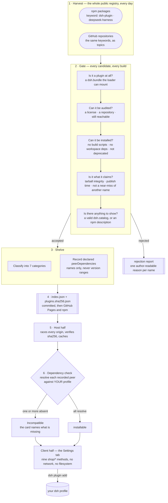

<div align="center">

# dsh-plugin-shop

**The plugin shop for [DeepSeek Harness](https://github.com/deepseek-ai/deepseek-harness)** — discover, install,
enable and update dsh plugins from a browsable, git-auditable catalog.

[](https://www.npmjs.com/package/dsh-plugin-shop)
[](https://LivXue.github.io/dsh-plugin-shop/v1/index.json)
[](https://LivXue.github.io/dsh-plugin-shop/v1/index.json)
[](LICENSE)
[](https://github.com/LivXue/dsh-plugin-shop/actions/workflows/plugin.yml)
[](https://github.com/LivXue/dsh-plugin-shop/actions/workflows/daily.yml)

English | [中文](README.zh.md)

</div>

---

## 🖼️ Screenshots

<div align="center">

</div>

<table>
<tr>
<td width="50%"></td>
<td width="50%"></td>
</tr>
<tr>
<td align="center"><sub>Installing an unreviewed plugin requires an explicit acknowledgement</sub></td>
<td align="center"><sub>The same shelf in the dark theme</sub></td>
</tr>
</table>

## ✨ Highlights

| | |
|---|---|
| **🌐 Harvested from the whole registry** | Nothing is submitted here and there is no queue to join. Every npm package carrying the `dsh-plugin` or `deepseek-harness` keyword is examined on every build, plus every GitHub repository that uses the same keywords as topics. Today's build looked at **20,891 candidates**. |
| **🧹 Filtered, hard** | **11,514 of them did not reach the shelf** — 55% of everything examined. A package with no `dsh.bundle` is a library, not a plugin. No license or no repository means nothing can be audited. A build script or a `workspace:` dependency means the install would fail on your machine. A name a hair away from a popular one is held back until someone clears it. Seventeen recorded reasons, all mechanical, all applied on every build — and every rejection carries a line its author can read. |
| **🔌 Dependency-checked where you are** | The catalog records the peer modules each plugin declares; **2,513 of the 9,377 listings carry them**. Your own installation resolves those names against your own profile — the same question dsh's loader asks at mount time — and a card whose modules are absent reads **Incompatible** and names them. The verdict is computed on your machine, not baked in by the build, because the answer depends on the harness you are actually running. |
| **🗓️ Rebuilt every day** | The pipeline runs at 03:17 UTC and commits what it found, so every change to the catalog is a reviewable diff rather than a row in someone's database. New plugins appear the next morning; a repository that disappears drops out the same way. |
| **🗂️ Classified** | Seven categories, so nine thousand entries stay browsable: **tool** 4,584 · **ui** 2,356 · **integration** 777 · **other** 565 · **provider** 463 · **workflow** 401 · **theme** 231. An author who declares `dsh.catalog` picks their own; the rest are classified for them. |

## 🗺️ How it fits together



Steps 1–4 are this repository's `registry/`. Steps 5–6 are the npm package in
`packages/dsh-plugin-shop/`. They share no code — only the schema.

Two parts of that diagram are worth naming, because they are the ones people expect
to work differently:

- **The gate rejects; it never silently drops.** A candidate that fails becomes a
  named rejection with a reason, attached to the build. Nothing vanishes quietly.
- **The dependency check is not a catalog fact.** The build records only the peer
  *names* — never their version ranges, because nearly every dsh plugin declares
  `"*"` and the harness's own prereleases do not satisfy ordinary ranges, so checking
  them would accuse plugins that work. Whether a name resolves is decided by your
  installation, against your profile.

## 📦 Install the shop

Two tracks. They do the same thing; pick the one that matches who is reading.

### 🧑 For people

**Prerequisites:** Node.js. Running the harness itself needs no install — the
upstream-documented form is `npx -y @deepseek-ai/dsh web`. Plugin management
goes through `dsh plugin`, which spawns both the `dsh` command and `pnpm` —
install them once with `npm install -g @deepseek-ai/dsh pnpm` and verify with
`dsh --version` and `pnpm --version`.

```sh
# dsh on PATH (global install). Pin the version: pnpm 11 holds back very
# recent releases, so a bare `add dsh-plugin-shop` can hand you an older
# version for a while. This is the current release — refresh it with
# `npm view dsh-plugin-shop version`.
dsh plugin --profile web add dsh-plugin-shop@0.7.2
# or straight through npx, nothing installed:
npx -y @deepseek-ai/dsh plugin --profile web add dsh-plugin-shop@0.7.2
```

Replace `web` with your profile if you use another one. Restart `dsh` once — a newly
added bundle is not applied to a running process — then open

> **Settings → Plugins → Plugin shop**

### 🤖 For agents

Non-interactive. `--profile` is **mandatory**; without it `dsh plugin` exits with
`error: required option '--profile <name>' not specified`.

```sh
# 1. resolve a profile name ($DSH_HOME defaults to ~/.dsh; node_modules is not a profile)
ls -1 "${DSH_HOME:-$HOME/.dsh}/profiles" | grep -v '^node_modules$'

# 2. install — pin the version: it bypasses pnpm's release cooldown and
#    deterministic installs are the point of the agent path
dsh plugin --profile <profile> add dsh-plugin-shop@0.7.2

# 3. verify — a zero exit above only means pnpm resolved the package
dsh plugin --profile <profile> list --depth 0   # dsh-plugin-shop must appear

# 4. restart the profile; a new bundle is not hot-applied
dsh --profile <profile>
```

The same fact as step 3 lives in `$DSH_HOME/profiles/<profile>/package.json` under
`dsh.profile.bundles`, if you would rather read the manifest than parse CLI output.
Per-failure diagnostics are in the
[package README](packages/dsh-plugin-shop/README.md#failure-modes).

## ✅ What it is

| | |
|---|---|
| **Public and community-run** | Publishing to npm with the `dsh-plugin` or `deepseek-harness` keyword is all it takes to be discovered. Nothing is submitted to this project. |
| **Git-auditable** | Every daily catalog change is a reviewable diff, not a row in someone's database. |
| **Tiered trust, honestly reported** | A review is pinned to the exact version it covered, so an author who passes review once cannot publish a malicious version and inherit the trust. **Today `registry/verified.yml` is empty: no listing has been read by a human, every entry is community-tier, and every install asks for the acknowledgement.** The filtering above is mechanical, and it is not a substitute for reading the code you are about to run. |
| **Zero-privilege UI** | Compromising the browser interface does not compromise the runtime. |

## 🚫 What it is not

> **It is not a sandbox.** A dsh plugin, once mounted, holds the full `ctx` — your
> filesystem, your shell, and the requests going to the model. Installing one is
> complete trust. This project does not change that; it tells you the truth before you
> click.

It also carries no download counts, ratings, or reviews, and it will never offer an
"install from arbitrary URL" button. That capability stays in `dsh plugin add`, where
enabling build scripts and pinning a commit are decisions you make explicitly.

## 📚 The catalog

Built daily and published as static JSON, to two places at once: the npm package
`dsh-plugin-shop-catalog` and GitHub Pages. Your installation races them — the
registry you have configured, npmmirror, npmjs, then Pages — and takes whichever
answers first, because the link to one of them can be far slower than the link to
another from where you sit. All of them carry the same bytes, and the sha256 in the
pointer is checked before any of them is trusted. `DSH_SHOP_CATALOG_URL` opts out of
the race and reads only what you name.

| Artifact | Purpose |
|---|---|
| [`/v1/index.json`](https://LivXue.github.io/dsh-plugin-shop/v1/index.json) | The pointer — `schemaVersion`, `builtAt`, the entry `count` and `rejected` totals (the badges above read them live), and the content hash. Small enough to poll. |
| `/v1/plugins.<sha256>.json` | The data — content-addressed, safe to cache indefinitely. |
| `/v1/stars.<sha256>.json` | GitHub star counts by package name, when the daily build could fetch them |

Each build's rejection report, carrying an author-readable reason for every rejected
package, is attached to the workflow run. Nothing disappears without a reason attached
to its name.

## 🏷️ Listing a plugin

Add a harvest keyword (`dsh-plugin` or `deepseek-harness`) to your `package.json` and publish to npm; the daily build picks it up. A plugin that never publishes to npm is listed from its GitHub repository instead: add the same keyword as a repo *topic* and keep a `package.json` at the root with a `name` and `dsh.bundle` — the catalog pins the default-branch commit as the version.
A `dsh.catalog` section is optional — declare it to control your own category, summary
and capabilities, or omit it and the catalog derives a listing from your npm
`description` instead.

```json
{
  "name": "dsh-hello-plugin",
  "keywords": ["dsh-plugin"],
  "dsh": {
    "bundle":  { "patch": "./cordis.patch.yml" },
    "catalog": {
      "category": "tool",
      "summary": { "en": "...", "zh": "..." },
      "capabilities": ["fs", "shell"]
    }
  }
}
```

Full field reference: [docs/schema.md](docs/schema.md).

**Not listed, and why:** a package without `dsh.bundle` is a library rather than an
installable plugin. A package without a license or a repository cannot be audited. A
package with neither a `dsh.catalog` section nor an npm `description` has nothing to
show.

## 🗂️ Repository layout

| Path | What lives there |
|---|---|
| `registry/` | The catalog pipeline — a pure core (`gate`, `tier`, `emit`, `pipeline`) behind an impure shell (`npm-client`, `build`) |
| `registry/verified.yml` | The human review record, pinned per version |
| `registry/denied.yml` | The denylist; every entry states why |
| `registry/snapshots/` | `manifest.lock`, committed daily |
| `packages/dsh-plugin-shop/` | The npm package — Host half and Client half |
| `docs/design/` | The specification. It is the authority; code follows it. |

## 🛠️ Development

```sh
pnpm install
pnpm test        # vitest
pnpm typecheck
```

`pnpm build:catalog` runs the real harvest against the public npm registry — roughly
1390 requests and several minutes. The tests cover every policy decision without a
network, so reach for it only when you have changed the fetching or writing layer.

Status and open work: [docs/plans/2026-08-18-remaining-work.md](docs/plans/2026-08-18-remaining-work.md).
Specification: [docs/design/2026-08-18-dsh-plugin-shop-design.md](docs/design/2026-08-18-dsh-plugin-shop-design.md).

## 📄 License

[Apache-2.0](LICENSE) © LivXue
