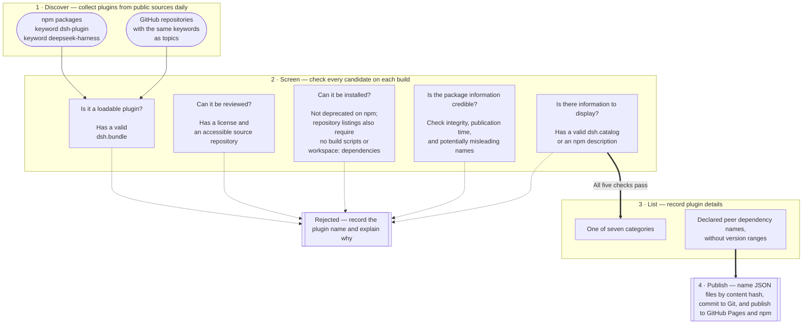
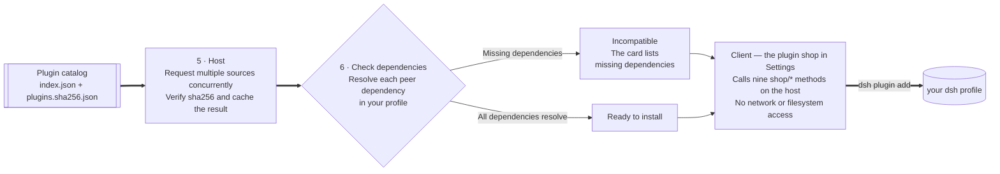

<div align="center">

# dsh-plugin-shop

**The plugin shop for [DeepSeek Harness](https://github.com/deepseek-ai/deepseek-harness)** — browse, install,
enable, disable, and update dsh plugins, with every catalog change tracked in Git.

[](https://www.npmjs.com/package/dsh-plugin-shop)
[](https://LivXue.github.io/dsh-plugin-shop/v1/index.json)
[](https://LivXue.github.io/dsh-plugin-shop/v1/index.json)
[](LICENSE)
[](https://github.com/LivXue/dsh-plugin-shop/actions/workflows/plugin.yml)
[](https://github.com/LivXue/dsh-plugin-shop/actions/workflows/daily.yml)

English | [中文](README.zh.md)

</div>

---

## 📦 Install the shop

Install the shop manually, or have an agent follow the automated steps below.

### 🧑 Manual installation

**Prerequisite:** Node.js. You can run DeepSeek Harness without a global installation
using the command in its official documentation: `npx -y @deepseek-ai/dsh web`.
Plugin management uses `dsh plugin`, which invokes both `dsh` and `pnpm`.
Install these tools with `npm install -g @deepseek-ai/dsh pnpm`, then check that both
are available with `dsh --version` and `pnpm --version`.

```sh
# With dsh installed globally, run the following command.
# Specify the version: pnpm 11 restricts newly published releases by default,
# so omitting the version may install an older release. The current version
# is shown below; check for updates with `npm view dsh-plugin-shop version`.
dsh plugin --profile web add dsh-plugin-shop@0.8.3
# Alternatively, run the installation command through npx:
npx -y @deepseek-ai/dsh plugin --profile web add dsh-plugin-shop@0.8.3
```

Replace `web` with your profile name if you use a different one. Restart `dsh` after
installation to load the new plugin, then open:

> **Settings → Plugins → Plugin shop**

### 🤖 Installation with an agent

An agent can run these steps without interaction. **The `--profile` option is required.**
If it is omitted, `dsh plugin` exits with this error:
`error: required option '--profile <name>' not specified`.

```sh
# 1. List available profiles ($DSH_HOME defaults to ~/.dsh; exclude node_modules).
ls -1 "${DSH_HOME:-$HOME/.dsh}/profiles" | grep -v '^node_modules$'

# 2. Specify the version to bypass pnpm's release cooldown and ensure
#    that the expected version is installed.
dsh plugin --profile <profile> add dsh-plugin-shop@0.8.3

# 3. Verify the installation; exit code 0 above only means pnpm resolved the package.
dsh plugin --profile <profile> list --depth 0   # The output should include dsh-plugin-shop.

# 4. Restart the profile to load the new plugin.
dsh --profile <profile>
```

You can also verify step 3 by checking that `dsh.profile.bundles` in
`$DSH_HOME/profiles/<profile>/package.json` includes the plugin. For troubleshooting,
see the [package README](packages/dsh-plugin-shop/README.md#failure-modes).

## 🖼️ Screenshots

<div align="center">

</div>

<table>
<tr>
<td width="50%"></td>
<td width="50%"></td>
</tr>
<tr>
<td align="center"><sub>Confirmation is required before installing an unreviewed plugin</sub></td>
<td align="center"><sub>The plugin shop in dark mode</sub></td>
</tr>
</table>

## ✨ Highlights

- **🌐 Automatic discovery** — the catalog collects npm packages with the
  `dsh-plugin` or `deepseek-harness` keyword and GitHub repositories with either
  topic. Authors do not need to submit an application or join a queue.
- **🧹 Strict screening** — every candidate is checked automatically on each build.
  Rejected plugins are recorded by name with one of seventeen predefined reasons
  and a detailed explanation to help authors troubleshoot. The `plugins` and
  `filtered` badges above show the current totals.
- **🔌 Local dependency checks** — the shop resolves each declared peer dependency
  in your profile, just as the dsh loader does when loading a plugin. A card shows
  **Incompatible** only when a dependency is missing from your environment.
- **🗓️ Daily updates** — the catalog is rebuilt daily, with changes committed to
  Git for review. Eligible new plugins are listed the next morning, and plugins
  whose repositories are no longer available are removed during the same process.
- **🗂️ Seven categories** — authors can choose a category through `dsh.catalog`.
  Otherwise, the build assigns one automatically.

<a id="-how-it-fits-together"></a>

## 🗺️ How it works

**The catalog is built daily in this repository.** The build code lives in `registry/`.



**The shop runs locally as an npm package.** Its code lives in `packages/dsh-plugin-shop/`.
The catalog build and the local shop share a data schema; their code is independent.



Two details are useful to understand:

- **Every rejected plugin is documented.** The build report records its name and
  explains which check it failed, so authors can investigate.
- **Compatibility depends on your local environment.** The catalog records peer
  dependency *names*, without version ranges. Nearly all dsh plugins declare `"*"`,
  but the harness's prereleases do not satisfy ordinary version ranges. Checking
  those ranges would incorrectly mark working plugins as incompatible. Instead,
  the shop checks whether each dependency can be resolved in your profile.

## ✅ Project principles

| | |
|---|---|
| **Open to the community** | Publish to npm with the `dsh-plugin` or `deepseek-harness` keyword to make your plugin discoverable. No separate submission to this project is needed. |
| **Traceable changes** | Catalog updates are committed to Git daily, so you can inspect each change and its history. |
| **Explicit trust levels** | A human review applies only to the exact version reviewed. Other versions cannot inherit that status, preventing an author from using an earlier review to endorse a malicious release. **Currently, `registry/verified.yml` is empty: no catalog entries have been reviewed by a human. All plugins are in the community tier and require confirmation before each installation.** Automated screening cannot replace a review of the plugin's code. |
| **Restricted UI permissions** | The browser interface has no network or filesystem access. Compromising it does not grant runtime privileges. |

## 🚫 Permissions and limitations

> **The shop does not provide sandbox isolation.** Once loaded, a dsh plugin has
> access to the full `ctx`, including your filesystem, shell, and requests sent to
> the model. Installing a plugin means trusting it with these permissions. The shop
> explains them before installation, but does not restrict what a running plugin can do.

The shop does not display download counts, ratings, or reviews, and it will not offer
installation from arbitrary URLs. For that, use `dsh plugin add` and decide whether to
allow build scripts or pin a specific commit.

## 📚 Plugin catalog

The catalog is built daily and published as static JSON through the
`dsh-plugin-shop-catalog` npm package and GitHub Pages. The shop requests it from
multiple sources: your configured npm registry, npmmirror, npmjs, and GitHub Pages.
It uses the first valid response to avoid delays from a slow connection to any one
source. Each source serves identical data, which is checked against the sha256 hash
in the index before use. Set `DSH_SHOP_CATALOG_URL` to use only a specific source.

| File | Purpose |
|---|---|
| [`/v1/index.json`](https://LivXue.github.io/dsh-plugin-shop/v1/index.json) | The index: `schemaVersion`, `builtAt`, the `count` of listed plugins, the `rejected` total, and content hashes. The badges above read these totals live. The file is small enough for regular polling. |
| `/v1/plugins.<sha256>.json` | Plugin data, named by its content hash and safe to cache indefinitely. |
| `/v1/stars.<sha256>.json` | GitHub star counts for each plugin, keyed by package name, when the daily build can retrieve them. |

Each workflow run includes a rejection report listing every rejected plugin and the
reason it was excluded, with details to help authors troubleshoot.

When catalog content changes, the data filenames change with their content hashes,
and the old files are removed. However, `index.json` is cached for ten minutes, so it
may temporarily reference files that no longer exist. If you fetch data directly
from `/v1/` and a data URL returns 404, fetch `index.json` again. Alternatively, read
the same data from the `dsh-plugin-shop-catalog` npm package, which always bundles
the index with its matching data files.

## 🏷️ Listing a plugin

Add `dsh-plugin` or `deepseek-harness` to the keywords in your `package.json` and
publish to npm. The daily build will discover your plugin and list it once it passes
the checks. If you do not publish to npm, your plugin can be listed from its GitHub
repository: add either keyword as a repository topic and include `name` and
`dsh.bundle` in the root `package.json`. The catalog pins a specific commit from the
default branch as the plugin's version.

The optional `dsh.catalog` section lets you specify the category, summary, and
capabilities. Without it, the catalog generates a listing from your npm `description`.

```json
{
  "name": "dsh-hello-plugin",
  "keywords": ["dsh-plugin"],
  "dsh": {
    "bundle":  { "patch": "./cordis.patch.yml" },
    "catalog": {
      "category": "tool",
      "summary": { "en": "...", "zh": "..." },
      "capabilities": ["fs", "shell"]
    }
  }
}
```

See [docs/schema.md](docs/schema.md) for the full field reference.

**Common reasons for exclusion:**

- No `dsh.bundle`, so the package cannot be installed as a plugin.
- No license or source repository, so the package cannot be reviewed.
- Neither `dsh.catalog` nor an npm `description`, leaving no plugin information to display.

### 🌾 Which packages are discovered?

Discovery matches `dsh-plugin` and `deepseek-harness` in npm `keywords` or GitHub
repository topics, regardless of the package name. The `cordis-plugin` keyword
identifies the underlying framework, but does not establish that a package can be
installed as a DSH plugin. Built-in plugins distributed with dsh declare no npm
keywords, so this discovery process does not find them.

If your community plugin uses Cordis and integrates with DSH, add either keyword
and declare `dsh.bundle` in the appropriate manifest:

- **For npm packages:** use the `package.json` of the package you publish.
- **For GitHub repositories:** use the root `package.json`, which must also declare
  a `name`. In a monorepo, you can instead declare the bundle in the subpackage that
  provides the plugin.

A general-purpose Cordis library without `dsh.bundle` cannot be installed as a DSH plugin.

## 🗂️ Repository layout

| Path | Contents |
|---|---|
| `registry/` | The catalog pipeline. Core logic (`gate`, `tier`, `emit`, `pipeline`) uses pure functions; surrounding modules (`npm-client`, `build`) handle network requests, file access, and other side effects. |
| `registry/verified.yml` | Human review records tied to specific versions. |
| `registry/denied.yml` | The denylist, with a reason for each entry. |
| `registry/snapshots/` | Daily `manifest.lock` snapshots. |
| `packages/dsh-plugin-shop/` | The shop's npm package, containing the host and client components. |
| `docs/design/` | Design specifications that guide the implementation. |

## 🛠️ Development

```sh
pnpm install
pnpm test        # vitest
pnpm typecheck
```

`pnpm build:catalog` collects live data from npm and GitHub, making thousands of
network requests and taking several minutes. All policy decisions are covered by
offline tests. Run the full build when you change data fetching or file output and
need to verify the complete workflow.

Project status and remaining work: [docs/plans/2026-08-18-remaining-work.md](docs/plans/2026-08-18-remaining-work.md).
Design specification: [docs/design/2026-08-18-dsh-plugin-shop-design.md](docs/design/2026-08-18-dsh-plugin-shop-design.md).

## 🤝 Contributing

Contributions are welcome. Here are three ways to help, starting with a small correction:

- **Correct a classification.** A classifier assigns categories and determines
  whether a plugin is another plugin marketplace. The
  [build report](https://LivXue.github.io/dsh-plugin-shop/v1/report.md) lists every
  decision that has not been reviewed by a human. Correcting one takes a single
  line of YAML, with no network access, TypeScript changes, or local build required.
- **Publish your plugin.** Add a discovery keyword and publish. If the plugin does
  not appear in the shop, check the same build report for an explanation.
- **Improve the pipeline.** Follow the specifications in [`docs/design/`](docs/design/)
  and the development conventions in `CLAUDE.md`.

See the [contribution guide](CONTRIBUTING.md) for detailed instructions, and follow
the [Code of Conduct](CODE_OF_CONDUCT.md) when taking part in discussions. Report
vulnerabilities or malicious plugins privately through the
[security reporting process](SECURITY.md), not in a public issue.

## 📄 License

[Apache-2.0](LICENSE) © LivXue
