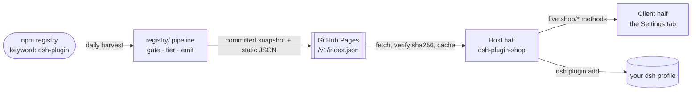

<div align="center">

# dsh-plugin-shop

**The plugin shop for [DeepSeek Harness](https://github.com/deepseek-ai/deepseek-harness)** — discover, install,
enable and update dsh plugins from a browsable, git-auditable catalog.

[](https://www.npmjs.com/package/dsh-plugin-shop)
[](LICENSE)
[](https://github.com/LivXue/dsh-plugin-shop/actions/workflows/plugin.yml)
[](https://github.com/LivXue/dsh-plugin-shop/actions/workflows/daily.yml)

English | [中文](README.zh.md)

</div>

---

## 🖼️ Screenshots

<div align="center">

</div>

<table>
<tr>
<td width="50%"></td>
<td width="50%"></td>
</tr>
<tr>
<td align="center"><sub>Installing an unreviewed plugin requires an explicit acknowledgement</sub></td>
<td align="center"><sub>The same shelf in the dark theme</sub></td>
</tr>
</table>

## 🗺️ How it fits together



Everything left of the Pages box is this repository's `registry/`. Everything right of
it is the npm package in `packages/dsh-plugin-shop/`. They share no code — only the
schema.

## 📦 Install the shop

Two tracks. They do the same thing; pick the one that matches who is reading.

### 🧑 For people

```sh
dsh plugin --profile web add dsh-plugin-shop
```

Replace `web` with your profile if you use another one. Restart `dsh` once — a newly
added bundle is not applied to a running process — then open

> **Settings → Plugins → Plugin shop**

### 🤖 For agents

Non-interactive. `--profile` is **mandatory**; without it `dsh plugin` exits with
`error: required option '--profile <name>' not specified`.

```sh
# 1. resolve a profile name ($DSH_HOME defaults to ~/.dsh; node_modules is not a profile)
ls -1 "${DSH_HOME:-$HOME/.dsh}/profiles" | grep -v '^node_modules$'

# 2. install
dsh plugin --profile <profile> add dsh-plugin-shop

# 3. verify — a zero exit above only means pnpm resolved the package
dsh plugin --profile <profile> list --depth 0   # dsh-plugin-shop must appear

# 4. restart the profile; a new bundle is not hot-applied
dsh --profile <profile>
```

The same fact as step 3 lives in `$DSH_HOME/profiles/<profile>/package.json` under
`dsh.profile.bundles`, if you would rather read the manifest than parse CLI output.
Per-failure diagnostics are in the
[package README](packages/dsh-plugin-shop/README.md#failure-modes).

## ✅ What it is

| | |
|---|---|
| **Public and community-run** | Publishing to npm with the `dsh-plugin` keyword is all it takes to be discovered. Nothing is submitted to this project. |
| **Git-auditable** | Every daily catalog change is a reviewable diff, not a row in someone's database. |
| **Tiered trust** | Reviewed and unreviewed plugins are visually distinct, and a review is pinned to the exact version it covered — an author who passes review cannot publish a malicious version and inherit the trust. |
| **Zero-privilege UI** | Compromising the browser interface does not compromise the runtime. |

## 🚫 What it is not

> **It is not a sandbox.** A dsh plugin, once mounted, holds the full `ctx` — your
> filesystem, your shell, and the requests going to the model. Installing one is
> complete trust. This project does not change that; it tells you the truth before you
> click.

It also carries no download counts, ratings, or reviews, and it will never offer an
"install from arbitrary URL" button. That capability stays in `dsh plugin add`, where
enabling build scripts and pinning a commit are decisions you make explicitly.

## 📚 The catalog

Built daily and published as static JSON:

| Artifact | Purpose |
|---|---|
| [`/v1/index.json`](https://LivXue.github.io/dsh-plugin-shop/v1/index.json) | The pointer — `schemaVersion`, `builtAt`, and the content hash. Small enough to poll. |
| `/v1/plugins.<sha256>.json` | The data — content-addressed, safe to cache indefinitely. |

Each build's rejection report, carrying an author-readable reason for every rejected
package, is attached to the workflow run. Nothing disappears without a reason attached
to its name.

## 🏷️ Listing a plugin

Add the keyword to your `package.json` and publish to npm; the daily build picks it up.
A `dsh.catalog` section is optional — declare it to control your own category, summary
and capabilities, or omit it and the catalog derives a listing from your npm
`description` instead.

```json
{
  "name": "dsh-hello-plugin",
  "keywords": ["dsh-plugin"],
  "dsh": {
    "bundle":  { "patch": "./cordis.patch.yml" },
    "catalog": {
      "category": "tool",
      "summary": { "en": "...", "zh": "..." },
      "capabilities": ["fs", "shell"]
    }
  }
}
```

Full field reference: [docs/schema.md](docs/schema.md).

**Not listed, and why:** a package without `dsh.bundle` is a library rather than an
installable plugin. A package without a license or a repository cannot be audited. A
package with neither a `dsh.catalog` section nor an npm `description` has nothing to
show.

## 🗂️ Repository layout

| Path | What lives there |
|---|---|
| `registry/` | The catalog pipeline — a pure core (`gate`, `tier`, `emit`, `pipeline`) behind an impure shell (`npm-client`, `build`) |
| `registry/verified.yml` | The human review record, pinned per version |
| `registry/denied.yml` | The denylist; every entry states why |
| `registry/snapshots/` | `manifest.lock`, committed daily |
| `packages/dsh-plugin-shop/` | The npm package — Host half and Client half |
| `docs/design/` | The specification. It is the authority; code follows it. |

## 🛠️ Development

```sh
pnpm install
pnpm test        # vitest
pnpm typecheck
```

`pnpm build:catalog` runs the real harvest against the public npm registry — roughly
1390 requests and several minutes. The tests cover every policy decision without a
network, so reach for it only when you have changed the fetching or writing layer.

Status and open work: [docs/plans/2026-08-18-remaining-work.md](docs/plans/2026-08-18-remaining-work.md).
Specification: [docs/design/2026-08-18-dsh-plugin-shop-design.md](docs/design/2026-08-18-dsh-plugin-shop-design.md).

## 📄 License

[MIT](LICENSE) © LivXue
