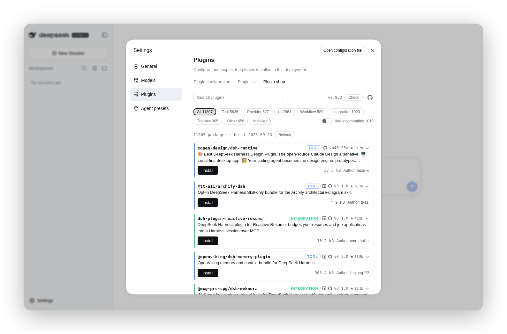
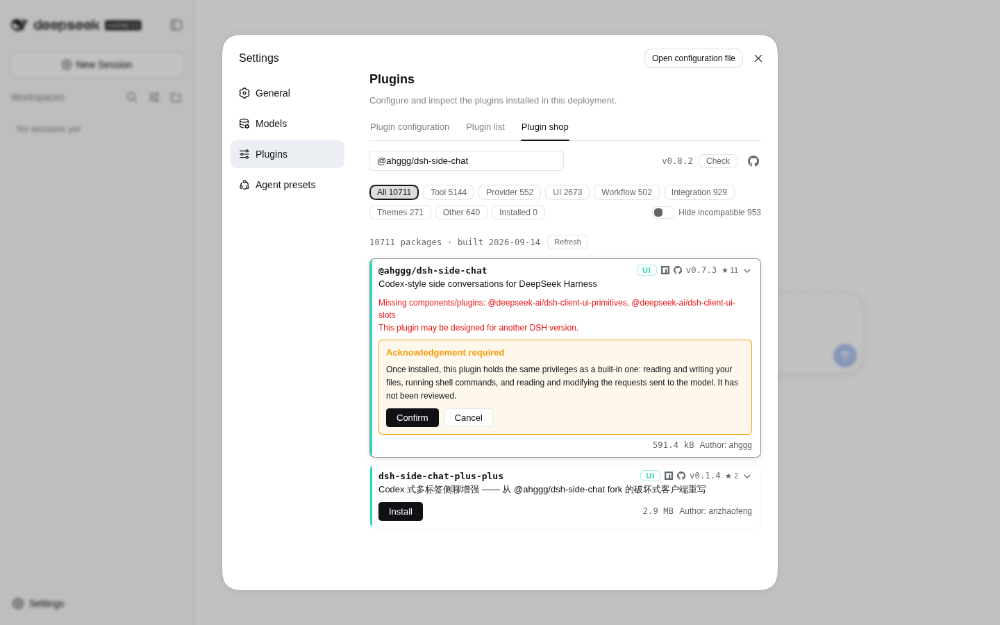
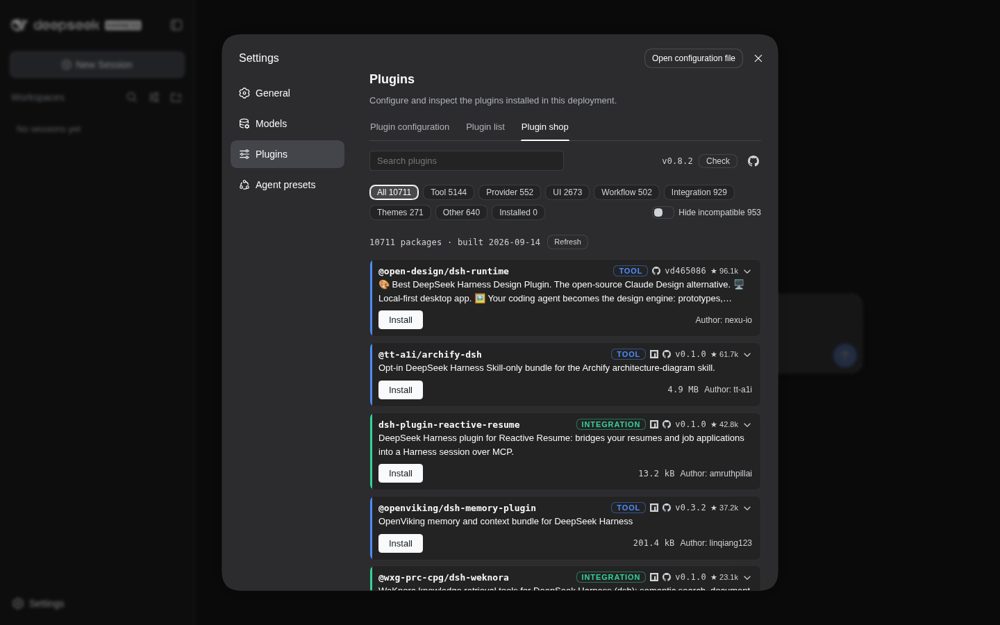
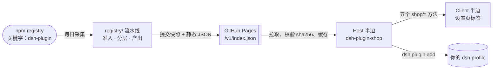

<div align="center">

# dsh-plugin-shop

**[DeepSeek Harness](https://github.com/deepseek-ai/deepseek-harness) 的插件商店** —— 从一份可浏览、
可用 git 审计的目录中发现、安装、启停和更新 dsh 插件。

[](https://www.npmjs.com/package/dsh-plugin-shop)
[](LICENSE)
[](https://github.com/LivXue/dsh-plugin-shop/actions/workflows/plugin.yml)
[](https://github.com/LivXue/dsh-plugin-shop/actions/workflows/daily.yml)

[English](README.md) | 中文

</div>

---

## 🖼️ 界面预览

<div align="center">

</div>

<table>
<tr>
<td width="50%"></td>
<td width="50%"></td>
</tr>
<tr>
<td align="center"><sub>安装未评审插件需要显式确认</sub></td>
<td align="center"><sub>深色主题下的同一片货架</sub></td>
</tr>
</table>

## 🗺️ 整体是怎么串起来的



Pages 那个框左边的一切属于本仓库的 `registry/`，右边的一切属于 `packages/dsh-plugin-shop/`
里的 npm 包。两者不共享代码，只共享 schema。

## 📦 安装商店

两条路做的是同一件事，按读者是谁挑一条。

### 🧑 给人看

```sh
dsh plugin --profile web add dsh-plugin-shop
```

用的不是 `web` 就换成你自己的 profile。重启一次 `dsh`——新加的 bundle 不会作用于已在运行的
进程——然后打开

> **设置 → 插件 → 插件商店**

### 🤖 给 agent 看

全程非交互。`--profile` 是**必填**的；不给它，`dsh plugin` 会以
`error: required option '--profile <name>' not specified` 退出。

```sh
# 1. 确定 profile 名（$DSH_HOME 默认 ~/.dsh；node_modules 不是 profile）
ls -1 "${DSH_HOME:-$HOME/.dsh}/profiles" | grep -v '^node_modules$'

# 2. 安装
dsh plugin --profile <profile> add dsh-plugin-shop

# 3. 验证——上一步返回 0 只说明 pnpm 解析到了这个包
dsh plugin --profile <profile> list --depth 0   # dsh-plugin-shop 必须出现

# 4. 重启该 profile；新 bundle 不是热生效的
dsh --profile <profile>
```

第 3 步的同一事实也存在于 `$DSH_HOME/profiles/<profile>/package.json` 的
`dsh.profile.bundles`——如果你更愿意读清单而不是解析 CLI 输出。逐条的失败诊断见
[包内 README](packages/dsh-plugin-shop/docs/README.zh.md#失败模式)。

## ✅ 它是什么

| | |
|---|---|
| **公开、由社区驱动** | 带 `dsh-plugin` 关键字发布到 npm 就会被发现，不需要向本项目提交任何东西。 |
| **可用 git 审计** | 每日目录变更都是一份可评审的 diff，而不是某个数据库里的一行。 |
| **分层信任** | 已评审与未评审的插件在视觉上可区分，且评审钉在它当初覆盖的那个确切版本上——作者过了一次评审，不能靠发布恶意新版本来继承这份信任。 |
| **零权限界面** | 攻破浏览器界面并不等于攻破运行时。 |

## 🚫 它不是什么

> **它不是沙箱。** dsh 插件一旦挂载，就持有完整的 `ctx`——你的文件系统、你的 shell、以及发往
> 模型的请求。安装一个插件就是完全信任。本项目不改变这一点，它只是在你点下去之前把真相告诉你。

它也不提供下载量、评分或评论，并且永远不会提供"从任意 URL 安装"的按钮。那个能力留在
`dsh plugin add` 里——在那里，是否启用构建脚本、是否钉住某个 commit，都是你显式作出的决定。

## 📚 目录（catalog）

每日构建，以静态 JSON 发布：

| 产物 | 用途 |
|---|---|
| [`/v1/index.json`](https://LivXue.github.io/dsh-plugin-shop/v1/index.json) | 指针——`schemaVersion`、`builtAt` 和内容哈希。足够小，适合轮询。 |
| `/v1/plugins.<sha256>.json` | 数据——内容寻址，可无限期缓存。 |

每次构建的拒绝报告都会附在该次 workflow run 上，其中对每个被拒包都写明作者可读的原因。不会有
任何东西在没有理由的情况下消失。

## 🏷️ 让你的插件上架

在 `package.json` 里加上关键字并发布到 npm，每日构建就会收录。`dsh.catalog` 段是可选的——声明
它可以自己掌控分类、简介和 capabilities；不声明，目录会从你的 npm `description` 推导一条 listing。

```json
{
  "name": "dsh-hello-plugin",
  "keywords": ["dsh-plugin"],
  "dsh": {
    "bundle":  { "patch": "./cordis.patch.yml" },
    "catalog": {
      "category": "tool",
      "summary": { "en": "...", "zh": "..." },
      "capabilities": ["fs", "shell"]
    }
  }
}
```

完整字段参考：[docs/schema.zh.md](docs/schema.zh.md)。

**哪些不会上架，以及为什么：** 没有 `dsh.bundle` 的包是库而不是可安装插件；没有 license 或没有
仓库地址的包无法被审计；既没有 `dsh.catalog` 段也没有 npm `description` 的包，没有任何内容可展示。

## 🗂️ 仓库结构

| 路径 | 内容 |
|---|---|
| `registry/` | 目录流水线——纯核心（`gate`、`tier`、`emit`、`pipeline`）包在非纯外壳（`npm-client`、`build`）里 |
| `registry/verified.yml` | 人工评审记录，按版本钉住 |
| `registry/denied.yml` | 拒绝清单，每条都写明理由 |
| `registry/snapshots/` | `manifest.lock`，每日提交 |
| `packages/dsh-plugin-shop/` | npm 包——Host 半边与 Client 半边 |
| `docs/design/` | 规格说明。它是权威，代码跟随它。（英文） |

## 🛠️ 开发

```sh
pnpm install
pnpm test        # vitest
pnpm typecheck
```

`pnpm build:catalog` 会对公共 npm registry 跑真实采集——大约 1390 次请求、数分钟。所有策略判断
都有不联网的测试覆盖，所以只在你改了拉取层或写出层、需要端到端看一次时才用它。

状态与未完成工作：[docs/plans/2026-08-18-remaining-work.md](docs/plans/2026-08-18-remaining-work.md)。
规格说明：[docs/design/2026-08-18-dsh-plugin-shop-design.md](docs/design/2026-08-18-dsh-plugin-shop-design.md)。

## 📄 许可

[MIT](LICENSE) © LivXue
