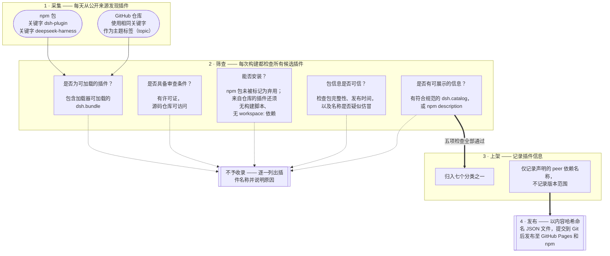
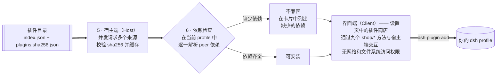

<div align="center">

# dsh-plugin-shop

**[DeepSeek Harness](https://github.com/deepseek-ai/deepseek-harness) 的插件商店** —— 浏览、安装、启用、停用和更新 dsh 插件，
插件目录的每次变更都可以通过 Git 追溯。

[](https://www.npmjs.com/package/dsh-plugin-shop)
[](https://LivXue.github.io/dsh-plugin-shop/v1/index.json)
[](https://LivXue.github.io/dsh-plugin-shop/v1/index.json)
[](LICENSE)
[](https://github.com/LivXue/dsh-plugin-shop/actions/workflows/plugin.yml)
[](https://github.com/LivXue/dsh-plugin-shop/actions/workflows/daily.yml)

[English](README.md) | 中文

</div>

---

## 📦 安装商店

你可以手动安装，也可以让 Agent 按下面的步骤自动安装。

### 🧑 手动安装

**环境要求：** Node.js。DeepSeek Harness 本身可以按官方文档直接用
`npx -y @deepseek-ai/dsh web` 启动，无需全局安装。不过，管理插件的 `dsh plugin` 命令会调用
`dsh` 和 `pnpm`，请先运行 `npm install -g @deepseek-ai/dsh pnpm` 安装这两个工具，
再用 `dsh --version` 和 `pnpm --version` 确认安装成功。

```sh
# 已全局安装 dsh 时，直接运行以下命令。
# 请明确指定版本号：pnpm 11 默认限制安装刚发布的版本，省略版本号可能会装到旧版。
# 下方使用当前版本，可用 `npm view dsh-plugin-shop version` 查询最新版本。
dsh plugin --profile web add dsh-plugin-shop@0.8.3
# 也可以通过 npx 执行安装命令：
npx -y @deepseek-ai/dsh plugin --profile web add dsh-plugin-shop@0.8.3
```

如果你使用的配置不是 `web`，请将命令中的 `web` 换成对应的 profile 名称。安装后需要重启 `dsh`，
新插件才会生效。随后打开：

> **设置 → 插件 → 插件商店**

### 🤖 通过 Agent 安装

以下步骤可由 Agent 自动执行，无需交互。**必须指定 `--profile`**，否则 `dsh plugin` 会报错并退出：
`error: required option '--profile <name>' not specified`。

```sh
# 1. 查看可用的 profile（$DSH_HOME 默认为 ~/.dsh；排除 node_modules 目录）
ls -1 "${DSH_HOME:-$HOME/.dsh}/profiles" | grep -v '^node_modules$'

# 2. 指定版本安装，避免 pnpm 的发布冷却期影响结果，确保安装的是预期版本
dsh plugin --profile <profile> add dsh-plugin-shop@0.8.3

# 3. 确认安装结果；上一步退出码为 0 只说明 pnpm 成功解析了包
dsh plugin --profile <profile> list --depth 0   # 列表中应包含 dsh-plugin-shop

# 4. 重启对应的 profile，使新插件生效
dsh --profile <profile>
```

第 3 步也可以通过读取配置文件完成：检查 `$DSH_HOME/profiles/<profile>/package.json` 的
`dsh.profile.bundles` 字段中是否包含该插件。遇到问题时，请参阅
[插件包 README 中的故障排查说明](packages/dsh-plugin-shop/docs/README.zh.md#失败模式)。

## 🖼️ 界面预览

<div align="center">

</div>

<table>
<tr>
<td width="50%"></td>
<td width="50%"></td>
</tr>
<tr>
<td align="center"><sub>安装未经评审的插件前，需要手动确认</sub></td>
<td align="center"><sub>深色主题下的插件商店</sub></td>
</tr>
</table>

## ✨ 亮点

- **🌐 自动发现插件** —— 从 npm 采集带有 `dsh-plugin` 或 `deepseek-harness` 关键字的包，
  同时采集使用这些主题标签（topic）的 GitHub 仓库。作者无需向本项目提交申请或排队等候。
- **🧹 严格筛查** —— 每次构建都会对所有候选插件进行自动检查。未通过的插件会逐一记录名称，
  按十七种预设原因分类，并附上具体说明，方便作者排查。顶部的 `plugins` 和 `filtered`
  徽章分别显示当前收录和过滤的数量。
- **🔌 本地依赖检查** —— 商店会在你使用的 profile 中逐一检查插件声明的 peer 依赖，
  检查方式与 dsh 加载插件时一致。只有本地确实缺少依赖时，插件卡片才会显示**不兼容**。
- **🗓️ 每日更新** —— 插件目录每天重建，变更会提交到 Git，方便逐项查看。
  符合条件的新插件会在次日早上上架，仓库已不存在的插件也会在更新时下架。
- **🗂️ 七个分类** —— 作者可以通过 `dsh.catalog` 指定分类，未指定的由构建流程自动归类。

<a id="-整体是怎么串起来的"></a>

## 🗺️ 工作原理

**插件目录每天在本仓库中构建**，相关代码位于 `registry/`。



**插件商店以 npm 包的形式在本地运行**，相关代码位于 `packages/dsh-plugin-shop/`。
目录构建和本地商店使用相同的数据结构定义（schema），代码相互独立。



其中有两点需要说明：

- **每个未收录的插件都有记录。** 构建报告会列出插件名称和未通过检查的原因，方便作者排查。
- **兼容性取决于本地环境。** 目录只记录 peer 依赖的**名称**，不记录版本范围。几乎所有 dsh 插件
  都将版本范围声明为 `"*"`，而 Harness 自身的预发布版本不满足普通版本范围，按版本校验会把本可
  正常运行的插件误判为不兼容。因此，商店会在你使用的 profile 中检查这些依赖是否能被解析。

## ✅ 项目特点

| | |
|---|---|
| **公开收录，社区参与** | 在 npm 发布时添加 `dsh-plugin` 或 `deepseek-harness` 关键字，即可被采集流程发现，无需向本项目另行提交申请。 |
| **变更可追溯** | 每天的目录变更都会提交到 Git，可以逐项查看差异和历史记录。 |
| **明确标注信任等级** | 人工评审结果仅对评审时的具体版本有效，其他版本不能沿用，避免作者通过一次评审后发布恶意版本。**目前 `registry/verified.yml` 为空，尚无经过人工评审的收录条目。所有插件都属于社区级别，每次安装前都需要确认。** 自动筛查不能代替对插件代码的人工审查。 |
| **界面权限受限** | 浏览器界面没有网络和文件系统访问权限。即使界面遭到入侵，也不会因此获得运行时权限。 |

## 🚫 使用须知

> **插件商店不提供沙箱隔离。** dsh 插件加载后，可以通过完整的 `ctx` 访问文件系统、执行 shell
> 命令，以及访问发往模型的请求。安装插件意味着你信任它使用这些权限。商店会在安装前说明这些
> 权限，但不会限制插件运行时的能力。

商店不展示下载量、评分或评论，也不会提供“从任意 URL 安装”的功能。如有需要，请使用
`dsh plugin add`，并自行决定是否允许执行构建脚本、是否固定到某个 commit。

## 📚 插件目录

插件目录每天构建，以静态 JSON 的形式同时发布到 npm 包 `dsh-plugin-shop-catalog` 和 GitHub Pages。
商店会向多个来源发起请求，包括你配置的 npm registry、npmmirror、npmjs 和 GitHub Pages，
优先使用最先返回的有效结果，减少单个来源访问缓慢带来的等待。各来源的数据完全一致，使用前都会
按照索引文件中的 sha256 校验内容。设置 `DSH_SHOP_CATALOG_URL` 后，商店将只读取指定来源。

| 文件 | 用途 |
|---|---|
| [`/v1/index.json`](https://LivXue.github.io/dsh-plugin-shop/v1/index.json) | 索引文件，包含 `schemaVersion`、`builtAt`、收录数 `count`、过滤数 `rejected` 和内容哈希。顶部徽章实时读取其中的数量；文件较小，适合定期轮询。 |
| `/v1/plugins.<sha256>.json` | 插件数据，以内容哈希命名，可永久缓存。 |
| `/v1/stars.<sha256>.json` | 各插件对应的 GitHub star 数，按包名记录，仅在每日构建成功获取时提供。 |

每次构建都会在对应的工作流运行记录中附上未收录报告，逐一列出插件及具体原因，方便作者排查。

目录内容更新后，数据文件名会随内容哈希变化，旧文件不再保留。但 `index.json` 会缓存十分钟，
因此可能暂时指向已删除的文件。如果你直接读取 `/v1/` 下的数据，遇到数据 URL 返回 404 时，
请重新获取 `index.json`。也可以从 npm 包 `dsh-plugin-shop-catalog` 读取相同的数据，
其中的索引和数据文件始终打包在一起，不会出现版本不一致的问题。

## 🏷️ 让你的插件上架

在 `package.json` 中添加 `dsh-plugin` 或 `deepseek-harness` 关键字并发布到 npm，插件就会在
每日构建时被发现，通过检查后收录。如果插件不发布到 npm，也可以通过 GitHub 仓库收录：
为仓库添加相同的主题标签（topic），并在根目录的 `package.json` 中声明 `name` 和 `dsh.bundle`。
目录会将默认分支的具体 commit 固定为该插件的版本。

`dsh.catalog` 是可选配置，可以用来指定分类、简介和能力声明（`capabilities`）。
如果没有这项配置，目录会根据 npm `description` 自动生成插件条目。

```json
{
  "name": "dsh-hello-plugin",
  "keywords": ["dsh-plugin"],
  "dsh": {
    "bundle":  { "patch": "./cordis.patch.yml" },
    "catalog": {
      "category": "tool",
      "summary": { "en": "...", "zh": "..." },
      "capabilities": ["fs", "shell"]
    }
  }
}
```

完整字段说明见 [docs/schema.zh.md](docs/schema.zh.md)。

**以下情况不会收录：** 没有 `dsh.bundle`，无法作为插件安装；缺少许可证或源码仓库地址，
不具备审查条件；既没有 `dsh.catalog`，也没有 npm `description`，缺少可展示的插件信息。

### 🌾 哪些包会被采集？

采集流程只匹配 npm `keywords` 或 GitHub 仓库主题标签中的 `dsh-plugin` 和 `deepseek-harness`，
不根据包名判断。`cordis-plugin` 只能说明包使用了 Cordis 框架，不能说明它可以作为 DSH 插件安装。
随 dsh 一起分发的内置插件没有声明 npm 关键字，因此也不会被这套采集流程发现。

如果你的社区插件基于 Cordis 并已接入 DSH，请添加上述任一关键字，并在正确的位置声明 `dsh.bundle`：

- **通过 npm 发布：** 写在所发布包的 `package.json` 中。
- **通过 GitHub 仓库收录：** 写在仓库根目录的 `package.json` 中，同时声明 `name`。
  如果使用 monorepo，也可以写在实际提供插件的子包中。

没有声明 `dsh.bundle` 的通用 Cordis 库不能作为 DSH 插件安装。

## 🗂️ 仓库结构

| 路径 | 内容 |
|---|---|
| `registry/` | 目录构建流程：核心逻辑（`gate`、`tier`、`emit`、`pipeline`）由纯函数实现，网络请求和文件读写等操作由外围模块（`npm-client`、`build`）负责 |
| `registry/verified.yml` | 人工评审记录，绑定具体版本 |
| `registry/denied.yml` | 拒绝清单，每条都写明理由 |
| `registry/snapshots/` | 每日提交的 `manifest.lock` 快照 |
| `packages/dsh-plugin-shop/` | 插件商店 npm 包，包含宿主端（Host）和界面端（Client） |
| `docs/design/` | 设计规格，作为代码实现的依据（英文） |

## 🛠️ 开发

```sh
pnpm install
pnpm test        # vitest
pnpm typecheck
```

`pnpm build:catalog` 会实际访问 npm 和 GitHub 采集数据，发起数千次网络请求，耗时数分钟。
所有规则判断都有离线测试覆盖。只有修改了数据获取或文件输出部分、需要验证完整流程时，才需要运行它。

项目进展与待办事项：[docs/plans/2026-08-18-remaining-work.md](docs/plans/2026-08-18-remaining-work.md)。
设计规格：[docs/design/2026-08-18-dsh-plugin-shop-design.md](docs/design/2026-08-18-dsh-plugin-shop-design.md)。

## 🤝 参与贡献

欢迎参与贡献，可以先从简单的分类纠错做起：

- **纠正分类结果。** 插件类别以及是否属于同类插件商店，由分类器自动判断。
  [构建报告](https://LivXue.github.io/dsh-plugin-shop/v1/report.md)会列出所有未经人工复核的结果。
  纠正一条结果只需修改一行 YAML，无需联网、编写 TypeScript 或在本地构建。
- **发布自己的插件。** 添加采集关键字后发布即可。如果商店中仍未显示，可以在同一份构建报告中
  查看对应插件的具体原因。
- **改进构建流程。** 实现应遵循 [`docs/design/`](docs/design/) 中的设计规格，开发约定见 `CLAUDE.md`。

详细步骤见[贡献指南](CONTRIBUTING.zh.md)，参与交流时请遵守[行为准则](CODE_OF_CONDUCT.zh.md)。
发现漏洞或恶意插件时，请通过[安全报告渠道](SECURITY.zh.md)私下联系，不要提交公开 issue。

## 📄 许可证

[Apache-2.0](LICENSE) © LivXue
