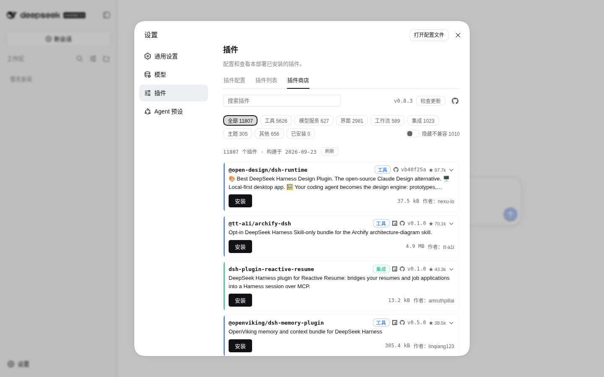
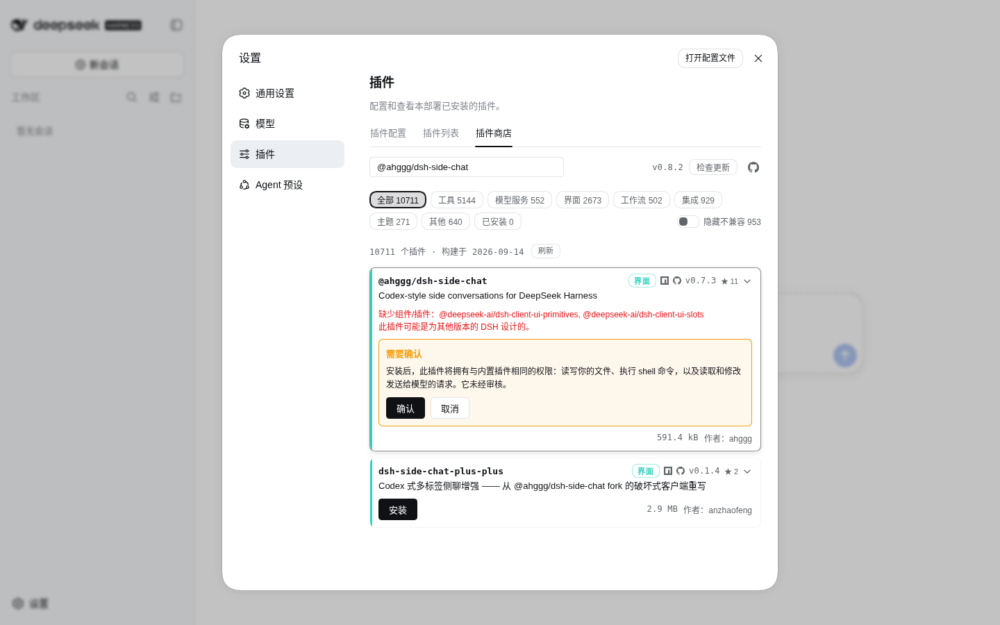
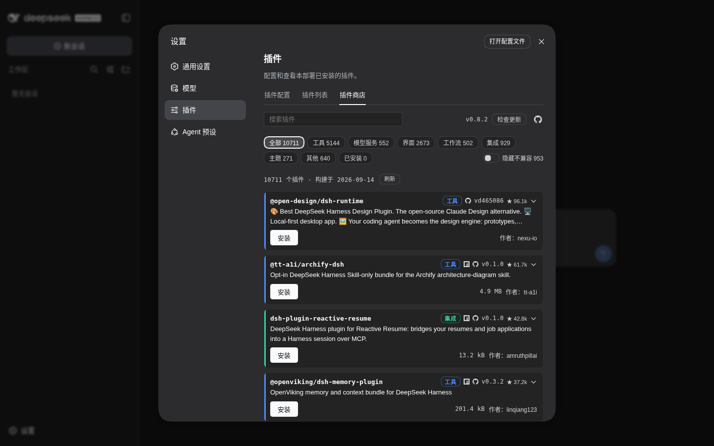
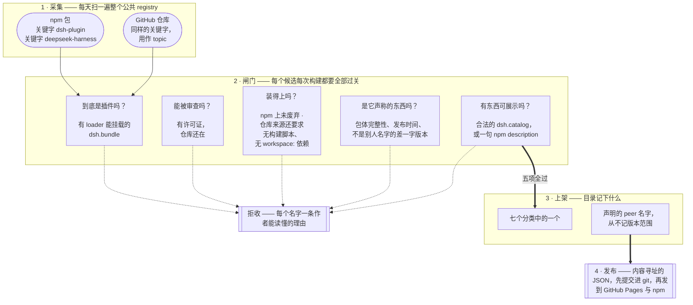
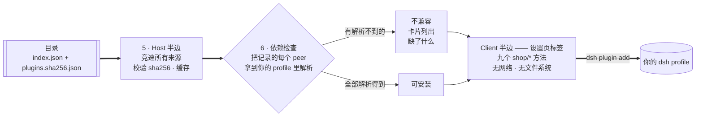

<div align="center">

# dsh-plugin-shop

**[DeepSeek Harness](https://github.com/deepseek-ai/deepseek-harness) 的插件商店** —— 从一份可浏览、
可用 git 审计的目录中发现、安装、启停和更新 dsh 插件。

[](https://www.npmjs.com/package/dsh-plugin-shop)
[](https://LivXue.github.io/dsh-plugin-shop/v1/index.json)
[](https://LivXue.github.io/dsh-plugin-shop/v1/index.json)
[](LICENSE)
[](https://github.com/LivXue/dsh-plugin-shop/actions/workflows/plugin.yml)
[](https://github.com/LivXue/dsh-plugin-shop/actions/workflows/daily.yml)

[English](README.md) | 中文

</div>

---

## 📦 安装商店

两条路做的是同一件事，按读者是谁挑一条。

### 🧑 给人看

**前置条件：** Node.js。运行 harness 本身无需安装——上游文档的形式是
`npx -y @deepseek-ai/dsh web`。插件管理经由 `dsh plugin`，它会分别 spawn
`dsh` 命令和 `pnpm`——用一条命令装好两者：`npm install -g @deepseek-ai/dsh
pnpm`，并用 `dsh --version` 和 `pnpm --version` 验证。

```sh
# dsh 在 PATH 上（全局安装）。必须钉版本号：pnpm 11 会拦下刚发布的新版本，
# 不写版本号的裸安装可能给你旧版。下面是当前版本——用
# `npm view dsh-plugin-shop version` 查最新值。
dsh plugin --profile web add dsh-plugin-shop@0.7.4
# 或全程走 npx，什么都不装：
npx -y @deepseek-ai/dsh plugin --profile web add dsh-plugin-shop@0.7.4
```

用的不是 `web` 就换成你自己的 profile。重启一次 `dsh`——新加的 bundle 不会作用于已在运行的
进程——然后打开

> **设置 → 插件 → 插件商店**

### 🤖 给 agent 看

全程非交互。`--profile` 是**必填**的；不给它，`dsh plugin` 会以
`error: required option '--profile <name>' not specified` 退出。

```sh
# 1. 确定 profile 名（$DSH_HOME 默认 ~/.dsh；node_modules 不是 profile）
ls -1 "${DSH_HOME:-$HOME/.dsh}/profiles" | grep -v '^node_modules$'

# 2. 安装——钉版本号：绕过 pnpm 的发布冷却期，确定性安装也是 agent 路径的要点
dsh plugin --profile <profile> add dsh-plugin-shop@0.7.4

# 3. 验证——上一步返回 0 只说明 pnpm 解析到了这个包
dsh plugin --profile <profile> list --depth 0   # dsh-plugin-shop 必须出现

# 4. 重启该 profile；新 bundle 不是热生效的
dsh --profile <profile>
```

第 3 步的同一事实也存在于 `$DSH_HOME/profiles/<profile>/package.json` 的
`dsh.profile.bundles`——如果你更愿意读清单而不是解析 CLI 输出。逐条的失败诊断见
[包内 README](packages/dsh-plugin-shop/docs/README.zh.md#失败模式)。

## 🖼️ 界面预览

<div align="center">

</div>

<table>
<tr>
<td width="50%"></td>
<td width="50%"></td>
</tr>
<tr>
<td align="center"><sub>安装未评审插件需要显式确认</sub></td>
<td align="center"><sub>深色主题下的同一片货架</sub></td>
</tr>
</table>

## ✨ 亮点

- **🌐 全网爬取** —— npm 上带 `dsh-plugin` 或 `deepseek-harness` 的包全部过一遍，加上把
  这些关键字用作 topic 的 GitHub 仓库。不用向本项目提交，也没有队可排。
- **🧹 严格筛查** —— 每个候选每次构建都要过一遍机械闸门，没过的会变成一条具名拒收，带上十七
  种记录在案的理由之一，并附一句作者能读懂的话。上面的 `plugins` 与 `filtered` 徽章实时统计
  两边的数量。
- **🔌 依赖检测在你本机** —— 你的安装拿记录下的每个 peer 名字去解析你自己的 profile，跟 dsh
  loader 挂载时问的是同一个问题，所以只有在**你这里**真的缺，卡片才显示**不兼容**。
- **🗓️ 每日更新** —— 结果提交进 git，所以每次变化都是一份可评审的 diff。新插件次日早上上架，
  仓库消失的以同样方式下架。
- **🗂️ 七个分类** —— 作者自己声明 `dsh.catalog` 就用他选的，其余由构建代为归类。

## 🗺️ 整体是怎么串起来的

**在本仓库里 —— 每日构建。** 这部分全属于 `registry/`。



**在你的机器上 —— npm 包。** 这部分全属于 `packages/dsh-plugin-shop/`。
两半不共享代码，只共享 schema。



有两处值得单独点出来，因为它们跟一般人的预期不同：

- **闸门是"拒收"，不是"悄悄丢掉"。** 每个没过的候选都会变成一条带理由的具名拒收，附在那次构建上。
- **依赖检查不是目录里的事实。** 构建只记 peer 的**名字**，从不记版本范围——因为几乎每个 dsh
  插件都声明 `"*"`，而 harness 自己发的预发布版本又不满足普通范围，真按范围校验，第一批被打成
  不兼容的就是那些实际能跑的插件。名字解析得到与否，由你的安装、对着你的 profile 决定。

## ✅ 它是什么

| | |
|---|---|
| **公开、由社区驱动** | 带 `dsh-plugin` 或 `deepseek-harness` 关键字发布到 npm 就会被发现，不需要向本项目提交任何东西。 |
| **可用 git 审计** | 每日目录变更都是一份可评审的 diff，而不是某个数据库里的一行。 |
| **分层信任，并如实交代** | 评审钉在它当初覆盖的那个确切版本上，作者过了一次评审，不能靠发布恶意新版本来继承这份信任。**但今天 `registry/verified.yml` 是空的：没有任何一条收录被人读过，全部条目都是社区层，每次安装都会要求你确认。** 上面那套筛查是机械的，它不能替代你亲自读一遍即将运行的代码。 |
| **零权限界面** | 攻破浏览器界面并不等于攻破运行时。 |

## 🚫 它不是什么

> **它不是沙箱。** dsh 插件一旦挂载，就持有完整的 `ctx`——你的文件系统、你的 shell、以及发往
> 模型的请求。安装一个插件就是完全信任。本项目不改变这一点，它只是在你点下去之前把真相告诉你。

它也不提供下载量、评分或评论，并且永远不会提供"从任意 URL 安装"的按钮。那个能力留在
`dsh plugin add` 里——在那里，是否启用构建脚本、是否钉住某个 commit，都是你显式作出的决定。

## 📚 目录（catalog）

每日构建，以静态 JSON 同时发到两处：npm 包 `dsh-plugin-shop-catalog` 和 GitHub Pages。你的
安装会**竞速**这几个来源——你自己配置的 registry、npmmirror、npmjs，然后是 Pages——谁先答就用
谁，因为从你所在的位置看，其中某条链路可能比另一条慢得多。它们承载的字节完全相同，而且在信任
任何一份之前都会核对指针里的 sha256。设 `DSH_SHOP_CATALOG_URL` 可以退出竞速，只读你指定的那个。

| 产物 | 用途 |
|---|---|
| [`/v1/index.json`](https://LivXue.github.io/dsh-plugin-shop/v1/index.json) | 指针——`schemaVersion`、`builtAt`、收录数 `count` 与过滤数 `rejected`（上面的徽章实时读它们）和内容哈希。足够小，适合轮询。 |
| `/v1/plugins.<sha256>.json` | 数据——内容寻址，可无限期缓存。 |
| `/v1/stars.<sha256>.json` | 按包名的 GitHub star 数（每日构建成功获取时） |

每次构建的拒绝报告都会附在该次 workflow run 上，其中对每个被拒包都写明作者可读的原因。不会有
任何东西在没有理由的情况下消失。

数据文件按内容寻址，所以每次构建都会发布新的文件名，旧的随即不再存在；而它们上面那个
`index.json` 有十分钟的缓存。如果你自己抓 `/v1/`，那么只要某个数据 URL 返回 404，就重新读一次
`index.json`——或者干脆从 npm 包 `dsh-plugin-shop-catalog` 读同样的字节，那里 pointer 和它所指的
数据永远装在同一个 tarball 里。

## 🏷️ 让你的插件上架

在 `package.json` 里加上采集关键字（`dsh-plugin` 或 `deepseek-harness`）并发布到 npm，每日构建就会
收录。从不发布 npm 的插件则按 GitHub 仓库上架：把同样的关键字作为仓库 *topic*，在仓库根放一个带
`name` 和 `dsh.bundle` 的 `package.json`——目录会把默认分支的 commit 钉为版本。`dsh.catalog` 段是可选的——声明它可以自己掌控分类、简介和 capabilities；不声明，目录会从你的
npm `description` 推导一条 listing。

```json
{
  "name": "dsh-hello-plugin",
  "keywords": ["dsh-plugin"],
  "dsh": {
    "bundle":  { "patch": "./cordis.patch.yml" },
    "catalog": {
      "category": "tool",
      "summary": { "en": "...", "zh": "..." },
      "capabilities": ["fs", "shell"]
    }
  }
}
```

完整字段参考：[docs/schema.zh.md](docs/schema.zh.md)。

**哪些不会上架，以及为什么：** 没有 `dsh.bundle` 的包是库而不是可安装插件；没有 license 或没有
仓库地址的包无法被审计；既没有 `dsh.catalog` 段也没有 npm `description` 的包，没有任何内容可展示。

## 🗂️ 仓库结构

| 路径 | 内容 |
|---|---|
| `registry/` | 目录流水线——纯核心（`gate`、`tier`、`emit`、`pipeline`）包在非纯外壳（`npm-client`、`build`）里 |
| `registry/verified.yml` | 人工评审记录，按版本钉住 |
| `registry/denied.yml` | 拒绝清单，每条都写明理由 |
| `registry/snapshots/` | `manifest.lock`，每日提交 |
| `packages/dsh-plugin-shop/` | npm 包——Host 半边与 Client 半边 |
| `docs/design/` | 规格说明。它是权威，代码跟随它。（英文） |

## 🛠️ 开发

```sh
pnpm install
pnpm test        # vitest
pnpm typecheck
```

`pnpm build:catalog` 会对 npm 和 GitHub 跑真实采集——数千次实时请求、数分钟。所有策略判断
都有不联网的测试覆盖，所以只在你改了拉取层或写出层、需要端到端看一次时才用它。

状态与未完成工作：[docs/plans/2026-08-18-remaining-work.md](docs/plans/2026-08-18-remaining-work.md)。
规格说明：[docs/design/2026-08-18-dsh-plugin-shop-design.md](docs/design/2026-08-18-dsh-plugin-shop-design.md)。

## 📄 许可

[Apache-2.0](LICENSE) © LivXue
